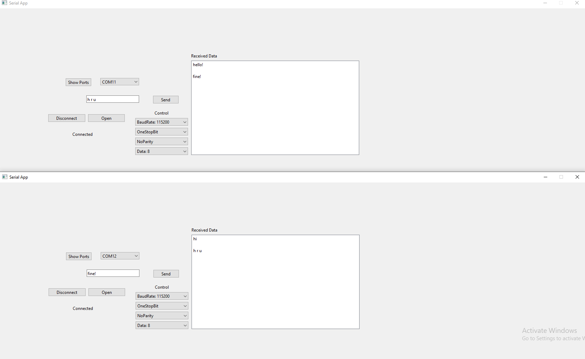

# Serial_App_QT
Serial Application to send data using Uart protocol with Qt6 Framework

 

 ### Description
- This is the first version of the serial app.
- main purpose of this app was to use it as flaher to flash my bootloader on tiva c.
- next version will be used to Read Bin file and follow the protocol that already designed to flash the bootloader.
- you still could use to communicate with serial devices that uses uart protocol.